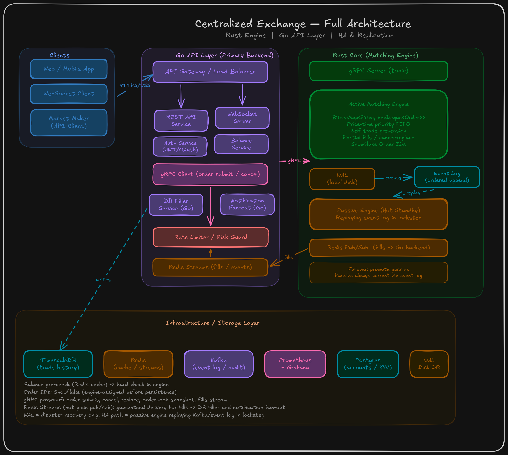

# Vertex

Centralized crypto exchange matching engine and trading infrastructure.

## Architecture



## Stack

| Layer | Language | Role |
|-------|----------|------|
| API Gateway | Go | REST + WebSocket, auth, rate limiting, balance cache |
| Matching Engine | Rust | Orderbook, matching, WAL, fills distribution |
| Storage | Postgres / Redis | Accounts, trade history, cache, streams |

## Quick Start

```bash
cp .env.example .env   # adjust JWT_SECRET etc.
make up                 # postgres, redis, engine, gateway — all in containers
make seed                # optional: demo trading pairs + funded demo users
make e2e                 # scripted register -> deposit -> cross -> fill smoke test
```

See the [`Makefile`](Makefile) for the full list of targets (`test`, `lint`, `logs`, `down`).

## Benchmarking

`make bench` runs a full-stack load test against a running gateway: it simulates many
users placing real orders over REST (crossing and resting, so it exercises matching,
the Redis fills pipeline, and WebSocket fan-out, not just placement), and reports
throughput, placement latency, fill rate, and fill latency percentiles. Account setup
bypasses REST entirely (direct Postgres insert + engine gRPC + in-process JWT minting)
so it isn't limited by the auth rate limiter; `-jwt-secret` must match the target
gateway's `JWT_SECRET`.

```bash
make bench JWT_SECRET=dev-secret-change-me BENCH_USERS=200 BENCH_DURATION=60s
```

See `api-gateway/cmd/benchmark -h` for the full set of flags (price/quantity jitter,
fixed order count instead of duration, deposit sizing, cleanup toggle, etc).

## Project Layout

```
engine/                    # Rust matching engine (tonic gRPC server)
  discussions/prd.md       # original product/design notes
api-gateway/                # Go REST + WebSocket service
proto/                      # Shared protobuf definitions
scripts/e2e.sh               # scripted end-to-end vertical-slice test
scripts/seed.sh               # demo trading pairs + funded demo users
docker-compose.yml            # postgres, redis, engine, gateway
```